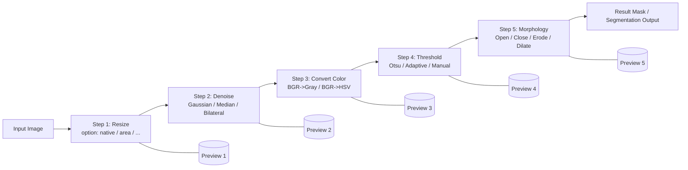

# drag and drop pipeline

Below is a concrete segmentation-style example, and then how you’d model + run it in **OpenCV.js** (with a UI that lets the user drag/drop steps 1..5).

## 1) The core idea: a consecutive pipeline

A “subprocess” is simply a function:

* **input**: `Mat`
* **output**: `Mat`
* **params**: user-editable
* optional **preview**: show output of each step

### Example segmentation pipeline (simple but real)

Goal: segment a foreground object from background in a robust way (classic binary segmentation).

1. **Resize** (speed + stable parameter ranges)
2. **Denoise** (Gaussian blur or bilateral filter)
3. **Color space / grayscale** (BGR → Gray, or BGR → HSV)
4. **Threshold** (Otsu / Adaptive / fixed)
5. **Morphology cleanup** (open/close to remove specks + fill holes)

That’s already a good “1..5” chain.

## 2) Diagram of your drag-and-drop idea

Here’s a diagram matching what you described: user selects step count (1..5), then chooses one operator per step from a palette (resize, blur, threshold, …). Each step uses the previous output.



In the UI, each box is a “node” the user can drop in. You can render previews under each node.

## 3) “Which subprocess can you see?” (good step palette for segmentation)

If you want the palette to feel powerful but not overwhelming, these are the most useful *atomic* steps:

### Preprocessing

* Resize (fast + consistent)
* Crop / ROI
* Normalize / histogram equalization (CLAHE)
* Blur: Gaussian / Median / Bilateral (noise control)

### Feature / representation

* Convert color: BGR→Gray, BGR→HSV
* Channel extract (HSV S/V, etc.)
* Edge detect (Canny) — more contour-oriented than segmentation

### Segmentation / mask creation

* Threshold: fixed, Otsu, adaptive
* InRange (HSV range masking) — super useful for color-based segmentation
* GrabCut (more advanced, interactive)

### Mask cleanup

* Morphology: erode/dilate/open/close
* Connected components / remove small blobs (filter by area)
* Fill holes (via morphology or floodfill)

### Postprocessing

* Contours extraction
* Smooth/approx polygon
* Vectorize/export

For a “1..5 steps” constraint, I’d start with: **Resize → Blur → ColorConvert → Threshold/InRange → Morphology**.

## 4) How to implement the chain in OpenCV.js (sequential Mat → Mat)

The key differences vs Python:

* In OpenCV.js you must manage memory: `mat.delete()`
* You can still “reuse output for next input” cleanly by returning a new `Mat` each step, or by writing into a preallocated `dst`.

### A minimal pipeline runner (OpenCV.js)

```js
// Each step: (src: cv.Mat) => cv.Mat
function runPipeline(src0, steps) {
  let cur = src0;         // cv.Mat
  let owned = false;      // if we created cur, we must delete it

  for (const step of steps) {
    const next = step(cur);

    // If cur was produced by a previous step, free it now.
    if (owned) cur.delete();

    cur = next;
    owned = true;
  }

  return cur; // caller owns and must delete()
}
```

### Example step implementations

```js
function stepResize({ maxW = 900 }) {
  return (src) => {
    const dst = new cv.Mat();
    const scale = Math.min(1, maxW / src.cols);
    const dsize = new cv.Size(Math.round(src.cols * scale), Math.round(src.rows * scale));
    cv.resize(src, dst, dsize, 0, 0, cv.INTER_AREA);
    return dst;
  };
}

function stepGray() {
  return (src) => {
    const dst = new cv.Mat();
    cv.cvtColor(src, dst, cv.COLOR_RGBA2GRAY); // or BGR2GRAY depending on your input
    return dst;
  };
}

function stepGaussianBlur({ k = 5 }) {
  return (src) => {
    const dst = new cv.Mat();
    const ksize = new cv.Size(k, k);
    cv.GaussianBlur(src, dst, ksize, 0, 0, cv.BORDER_DEFAULT);
    return dst;
  };
}

function stepOtsuThreshold() {
  return (src) => {
    const dst = new cv.Mat();
    cv.threshold(src, dst, 0, 255, cv.THRESH_BINARY | cv.THRESH_OTSU);
    return dst;
  };
}

function stepMorphClose({ k = 5, it = 1 }) {
  return (src) => {
    const dst = new cv.Mat();
    const kernel = cv.getStructuringElement(cv.MORPH_ELLIPSE, new cv.Size(k, k));
    cv.morphologyEx(src, dst, cv.MORPH_CLOSE, kernel, new cv.Point(-1, -1), it);
    kernel.delete();
    return dst;
  };
}
```

### Compose a 5-step segmentation pipeline

```js
const steps = [
  stepResize({ maxW: 900 }),
  stepGaussianBlur({ k: 5 }),
  stepGray(),
  stepOtsuThreshold(),
  stepMorphClose({ k: 7, it: 1 }),
];

// srcMat = cv.imread(canvas) or however you load it
const outMat = runPipeline(srcMat, steps);

// show result
cv.imshow(outputCanvas, outMat);

// cleanup
outMat.delete();
```

That is exactly the “output reused as input for the next call” pattern — just explicit.

## 5) How to map this to your drag-and-drop UI

Model each step as a small spec:

```ts
type StepSpec = {
  id: string;              // unique
  op: string;              // "resize" | "blur" | ...
  params: Record<string, any>;
};
```

Then your palette is basically:

* op metadata (name, category, input type constraints, parameter schema)
* a function factory that turns `StepSpec` into `(Mat)=>Mat`

Your UI:

* user picks **N = 1..5**
* for each slot i, user chooses an op and edits params
* you run the pipeline and render:

  * final output
  * optionally intermediate previews (after each step)

If you want, you can also allow branching later (graph instead of linear), but a 1..5 linear chain is a perfect v1.
 